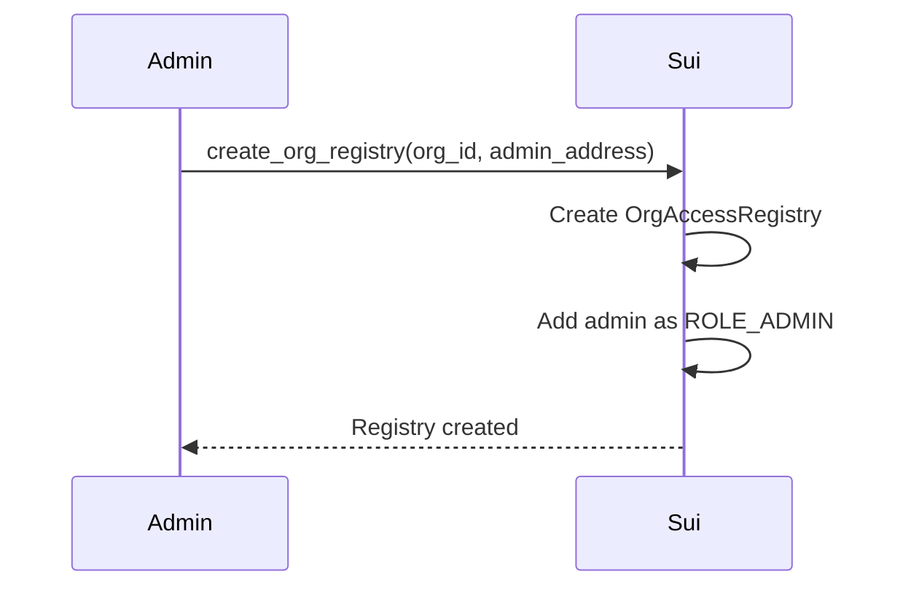
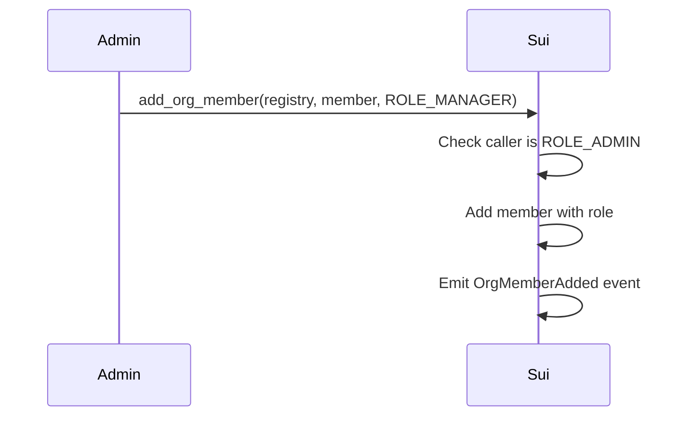
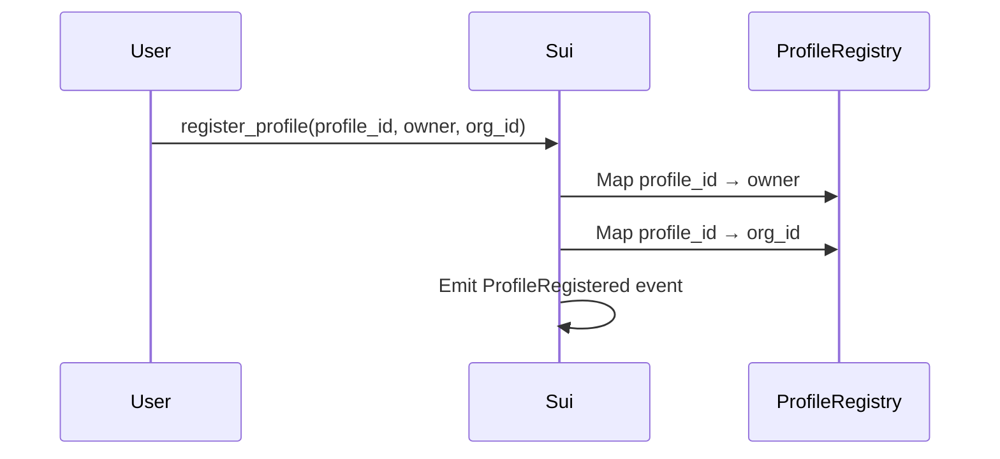
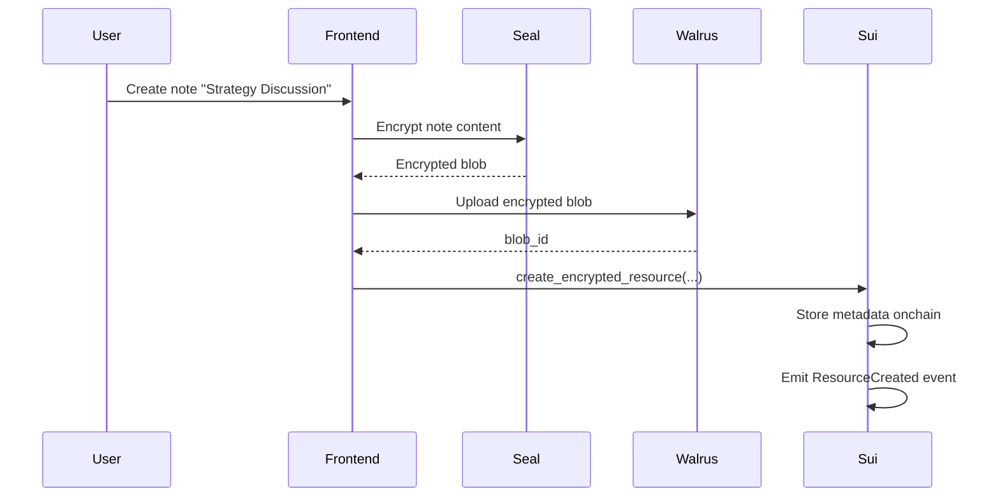
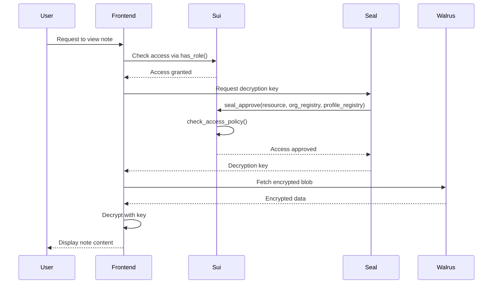

# CRM Access Control with Seal Integration

## Overview

This module provides **role-based access control** for your Sui CRM, integrated with **Seal** for encryption/decryption of sensitive notes and files. It replaces the government KYC example with a CRM-focused implementation.

## Architecture

### Core Components

1. **OrgAccessRegistry** - Tracks organization members and their roles
2. **ProfileAccessRegistry** - Maps profiles to owners and organizations
3. **EncryptedResource** - Stores metadata for encrypted notes/files in Walrus
4. **Seal Integration** - Enforces access policies for decryption

### Role Hierarchy

```
ROLE_ADMIN (3)    - Full access: manage members, view/edit all data
ROLE_MANAGER (2)  - Can view/edit contacts and notes (based on access_level)
ROLE_VIEWER (1)   - Read-only access to non-sensitive data
```

## Data Flow

### 1. Organization Setup



**Code:**
```move
// When creating an organization, also create its access registry
let org_registry = crm_access_control::create_org_registry(
    org_id,
    admin_address,
    ctx
);
```

### 2. Adding Team Members



**Code:**
```move
// Admin adds a manager
crm_access_control::add_org_member(
    &mut org_registry,
    manager_address,
    2, // ROLE_MANAGER
    ctx
);
```

### 3. Profile Registration



**Code:**
```move
// Register profile when created
crm_access_control::register_profile(
    &mut profile_registry,
    profile_id,
    owner_address,
    org_id,
    ctx
);
```

### 4. Creating Encrypted Notes/Files



**Code:**
```move
// Create encrypted note (Admin-only access)
let resource = crm_access_control::create_encrypted_resource(
    profile_id,
    org_id,
    1, // resource_type: 1=Note, 2=File
    walrus_blob_id,
    encryption_id,
    3, // access_level: ROLE_ADMIN only
    timestamp,
    ctx
);

// Transfer to profile owner or share
transfer::share_object(resource);
```

### 5. Decryption Flow (Seal Integration)



**Access Policy Logic:**
```move
// User can access if:
// 1. They own the profile, OR
// 2. They're an org member with role >= resource.access_level

fun check_access_policy(
    caller: address,
    resource: &EncryptedResource,
    org_registry: &OrgAccessRegistry,
    profile_registry: &ProfileAccessRegistry
): bool {
    // Profile owner always has access
    if (is_owner(caller, resource.profile_id)) {
        return true
    }
    
    // Org member with sufficient role
    if (has_role(org_registry, caller, resource.access_level)) {
        return true
    }
    
    false
}
```

## Usage Examples

### Example 1: Complete Organization Setup

```typescript
// 1. Create organization (in org.move)
const orgTx = new Transaction();
orgTx.moveCall({
  target: `${PACKAGE_ID}::org::create_org`,
  arguments: [
    orgTx.pure.string("Acme Web3 Studio"),
  ],
});

const orgResult = await signAndExecute(orgTx);
const orgId = getCreatedObjectId(orgResult);

// 2. Create access registry
const registryTx = new Transaction();
const registry = registryTx.moveCall({
  target: `${PACKAGE_ID}::crm_access_control::create_org_registry`,
  arguments: [
    registryTx.pure.id(orgId),
    registryTx.pure.address(adminAddress),
  ],
});

// Share the registry
registryTx.transferObjects([registry], adminAddress);
await signAndExecute(registryTx);
```

### Example 2: Adding Team Members

```typescript
// Add a manager
const tx = new Transaction();
tx.moveCall({
  target: `${PACKAGE_ID}::crm_access_control::add_org_member`,
  arguments: [
    tx.object(orgRegistryId),
    tx.pure.address(managerAddress),
    tx.pure.u8(2), // ROLE_MANAGER
  ],
});

await signAndExecute(tx);
```

### Example 3: Creating Profile with Registration

```typescript
// 1. Create profile
const profileTx = new Transaction();
const profile = profileTx.moveCall({
  target: `${PACKAGE_ID}::profile::create_profile`,
  arguments: [
    profileTx.pure.string("@cryptowhale"),
  ],
});

const profileResult = await signAndExecute(profileTx);
const profileId = getCreatedObjectId(profileResult);

// 2. Register in access control
const registerTx = new Transaction();
registerTx.moveCall({
  target: `${PACKAGE_ID}::crm_access_control::register_profile`,
  arguments: [
    registerTx.object(profileRegistryId), // Shared object
    registerTx.pure.id(profileId),
    registerTx.pure.address(ownerAddress),
    registerTx.pure.id(orgId),
  ],
});

await signAndExecute(registerTx);
```

### Example 4: Creating Encrypted Note

```typescript
// Frontend flow
async function createEncryptedNote(
  profileId: string,
  noteContent: string,
  accessLevel: number // 1=Viewer, 2=Manager, 3=Admin
) {
  // 1. Encrypt content with Seal
  const encryptedBlob = await sealEncrypt(noteContent, {
    profileId,
    orgId,
    accessLevel,
  });
  
  // 2. Upload to Walrus
  const walrusBlobId = await walrusUpload(encryptedBlob);
  
  // 3. Create onchain resource
  const tx = new Transaction();
  const resource = tx.moveCall({
    target: `${PACKAGE_ID}::crm_access_control::create_encrypted_resource`,
    arguments: [
      tx.pure.id(profileId),
      tx.pure.id(orgId),
      tx.pure.u8(1), // Note type
      tx.pure.vector('u8', Array.from(walrusBlobId)),
      tx.pure.vector('u8', Array.from(encryptedBlob.encryptionId)),
      tx.pure.u8(accessLevel),
      tx.pure.u64(Date.now()),
    ],
  });
  
  // Share so others can check access
  tx.transferObjects([resource], tx.pure.address(SHARED_ADDRESS));
  
  await signAndExecute(tx);
}
```

### Example 5: Decrypting Note (Frontend)

```typescript
async function decryptNote(resourceId: string) {
  // 1. Fetch resource metadata from Sui
  const resource = await suiClient.getObject({
    id: resourceId,
    options: { showContent: true },
  });
  
  const { profile_id, walrus_blob_id, encryption_id, access_level } = 
    resource.data.content.fields;
  
  // 2. Check access (frontend validation)
  const hasAccess = await checkAccess(
    currentUserAddress,
    resourceId,
    orgRegistryId,
    profileRegistryId
  );
  
  if (!hasAccess) {
    throw new Error("Access denied");
  }
  
  // 3. Request decryption from Seal
  // Seal will call seal_approve() onchain to verify
  const decryptionKey = await sealRequestKey(encryption_id, {
    resourceId,
    orgRegistryId,
    profileRegistryId,
  });
  
  // 4. Fetch encrypted blob from Walrus
  const encryptedBlob = await walrusFetch(walrus_blob_id);
  
  // 5. Decrypt locally
  const noteContent = await decrypt(encryptedBlob, decryptionKey);
  
  return noteContent;
}
```

## Access Control Matrix

| User Role | Own Profile Data | Team Profiles (Viewer) | Team Profiles (Manager) | Team Profiles (Admin) |
|-----------|------------------|------------------------|-------------------------|-----------------------|
| **Viewer** | ✅ Full Access | ✅ Read | ❌ No Access | ❌ No Access |
| **Manager** | ✅ Full Access | ✅ Read | ✅ Read/Write | ❌ No Access |
| **Admin** | ✅ Full Access | ✅ Read | ✅ Read/Write | ✅ Full Access |

## Events for Indexing

Your backend indexer should listen to these events:

```typescript
// Organization events
interface OrgMemberAdded {
  org_id: string;
  member: string;
  role: number;
}

interface OrgMemberRemoved {
  org_id: string;
  member: string;
}

// Profile events
interface ProfileRegistered {
  profile_id: string;
  owner: string;
  org_id: string;
}

// Resource events
interface ResourceCreated {
  resource_id: string;
  profile_id: string;
  resource_type: number; // 1=Note, 2=File
  access_level: number;
}
```

## Integration with Existing Modules

### Update `org.move`

```move
module sui_crm::org {
    use sui_crm::crm_access_control;
    
    public fun create_org(name: String, ctx: &mut TxContext) {
        let org = Org {
            id: object::new(ctx),
            name,
            admin: tx_context::sender(ctx),
        };
        
        let org_id = object::id(&org);
        
        // Create access registry
        let registry = crm_access_control::create_org_registry(
            org_id,
            tx_context::sender(ctx),
            ctx
        );
        
        transfer::share_object(registry);
        transfer::transfer(org, tx_context::sender(ctx));
    }
}
```

### Update `profile.move`

```move
module sui_crm::profile {
    use sui_crm::crm_access_control;
    
    public fun create_profile(
        username: String,
        org_id: ID,
        profile_registry: &mut ProfileAccessRegistry,
        ctx: &mut TxContext
    ) {
        let profile = Profile {
            id: object::new(ctx),
            username,
            owner: tx_context::sender(ctx),
        };
        
        let profile_id = object::id(&profile);
        
        // Register in access control
        crm_access_control::register_profile(
            profile_registry,
            profile_id,
            tx_context::sender(ctx),
            org_id,
            ctx
        );
        
        transfer::transfer(profile, tx_context::sender(ctx));
    }
}
```

## Next Steps

1. **Deploy Contracts**: Build and publish the updated module
2. **Integrate Seal SDK**: Set up Seal encryption in your frontend
3. **Integrate Walrus**: Configure Walrus client for file storage
4. **Build Frontend**: Implement note/file upload with encryption
5. **Set up Indexer**: Listen to events and populate database

## Security Considerations

✅ **Access control enforced onchain** - Seal verifies via `seal_approve()`  
✅ **Profile owners always have access** - Can't be locked out  
✅ **Role-based permissions** - Granular control per resource  
✅ **Encrypted at rest** - Walrus only stores encrypted blobs  
✅ **Auditable** - All access changes emit events  

## Testing

```bash
# Build contracts
cd contracts/sui_crm
sui move build

# Run tests
sui move test

# Deploy to testnet
sui client publish --gas-budget 100000000
```
